1. 更多 --> 网站地图菜单 --> 内容一览表
 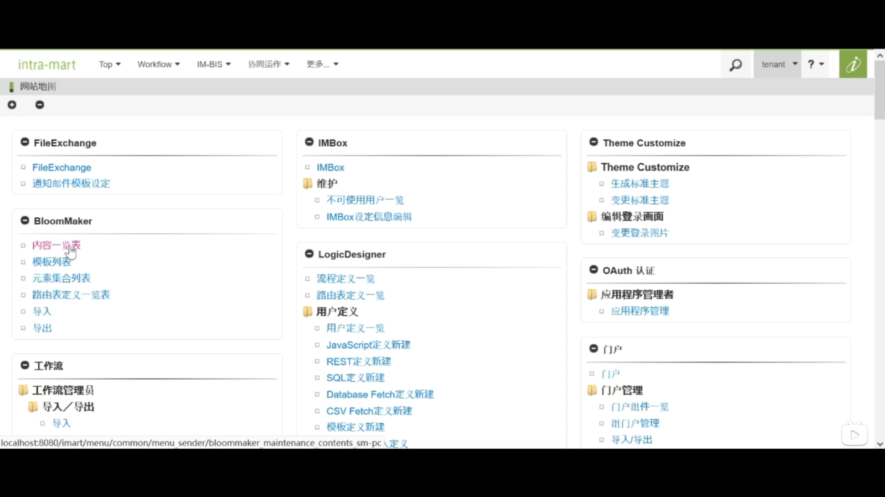  

2. 新建分类
左上角新建分类 输入各类信息
 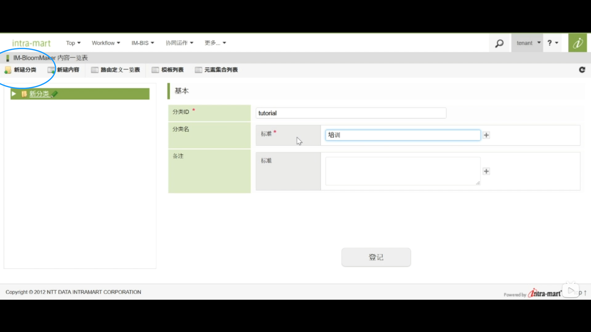  

3. 新建内容
内容类别选择 imui 输入ID和内容名
 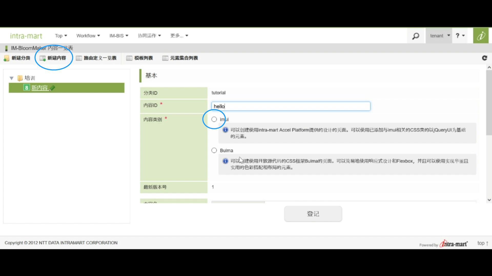

4. 点击设计编辑 进入内容页面
 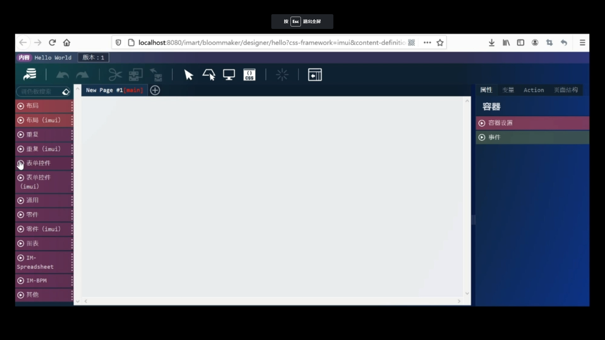

5. 将控件拖拽至右侧界面中来制作页面
 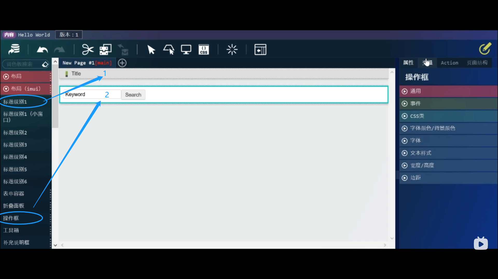

6. 点击右上角变量
点击新建图标 在键名中输入变量名 nameValue --> 决定

7. 为标题设置显示名 
选中标题 --> 属性选项卡 --> 元素固有值改为Hello World
 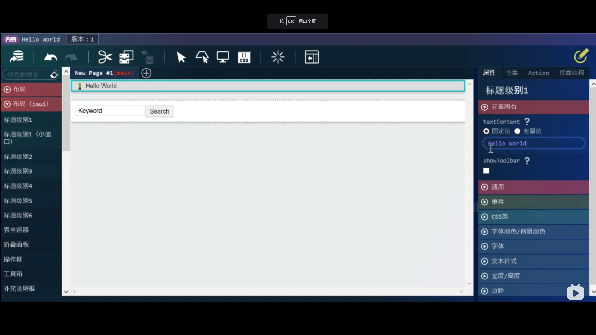

8. 为文本框设置变量值 
将元素固有中的value 从固定值改为变量值 --> 搜索图标 --> 选择之前的变量
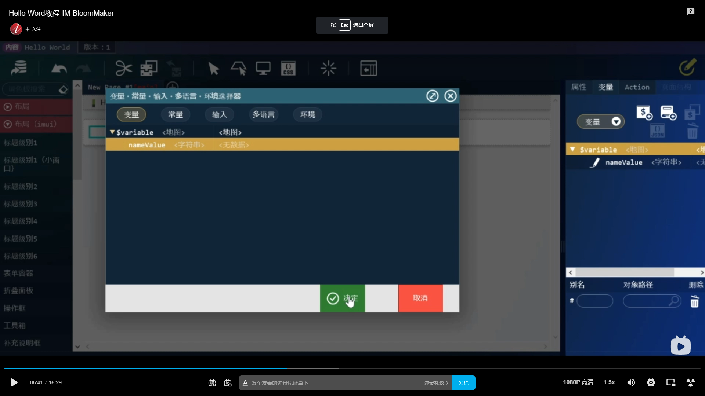

同样方法 将按钮名改为提交

9. 新建页面 
标题级别1（小窗口）拖拽至页面 --> 通用下拉框拖拽三个标签 --> 将第一个元素固有中的固定值改为“您好！” --> 第二个元素改为变量值 --> 第三个元素固定值改为“用户”
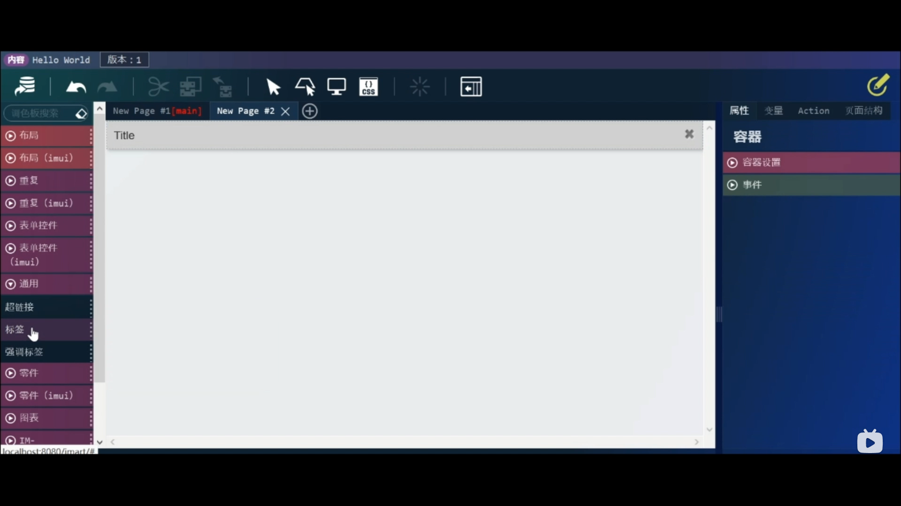

10. 第一个action
回到第一个页面 点击右侧选项栏action --> 新建图标 --> 设置action名称为“调用页面”
--> 标准 --> 在对话框中打开页面 --> 选择第二个页面 --> 决定
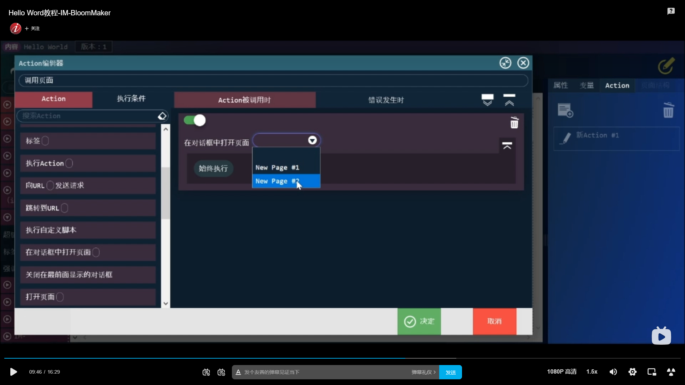

11. 第二个action
设置action名称为“关闭对话框” -->  标准 --> 关闭在最前面显示的对话框 --> 决定

12. 关联按钮和action
属性选项卡 --> 事件 --> 调用页面 --> 打开第二个页面 --> 选择打叉图标 --> 事件 --> 关闭对话框
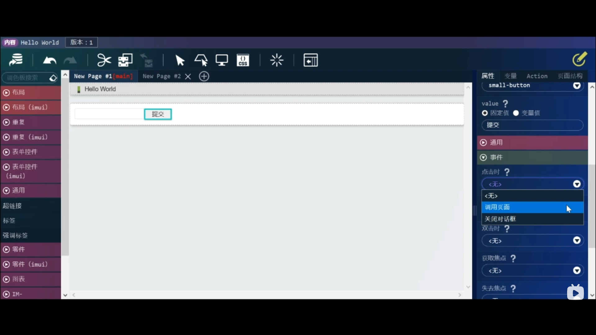

覆盖保存一次

13. 设置路由和权限
新建分类 --> ID和分类名输入对应内容 --> 登记
 
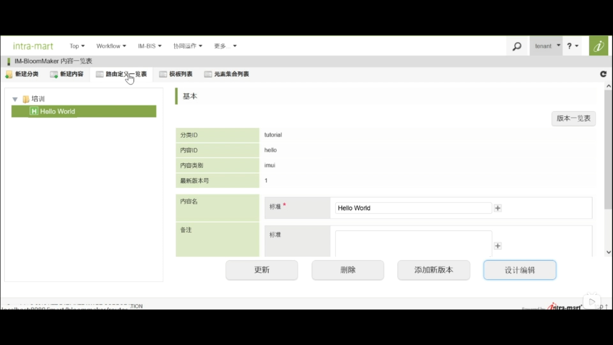

14. 新建路由 --> 1、2输入hello --> 3改为最新版本 --> 搜索之前新建的内容 --> 路由名称中输入“Hello World” --> 登记
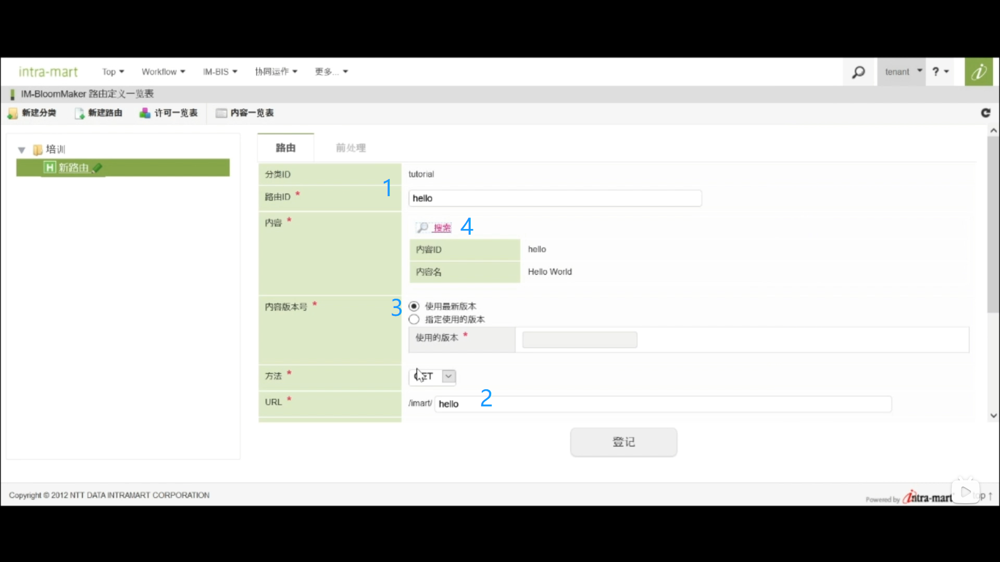

15. 设置权限 
点击许可URL右侧的齿轮图标 --> 开始权限设定 -->  认证用户打勾 --> 结束权限设定 
