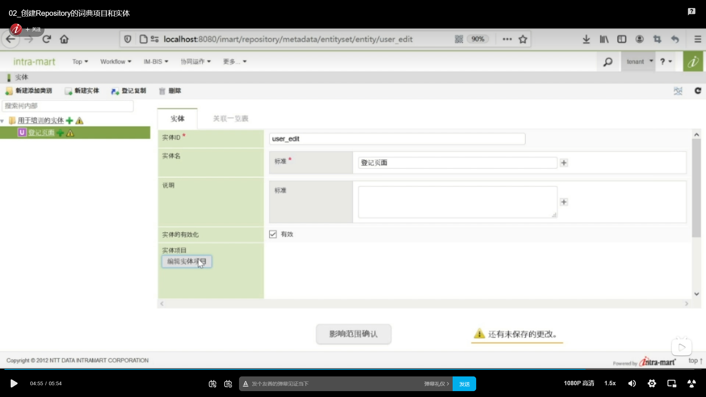

## 第一个词典项目
1. 新建词典项目
找到Repository --> 选择词典项目列表--> 新增类别 --> ID和类别名中输入对应内容 (tutorial_data  用于培训的词典项目)
   

2. 新建项目 --> 勾选用途中的数据和限制 --> 词典项目ID和项目名中输入userCd --> 数据 类型模板中选择TEXT  
   

3. 变量名全部改为userCd
   

4. 限制下拉栏选择字母和数字 --> 选择仅小写字母 -->  限制下拉栏选择userCd
 
5. 第一个词典项目设置完毕

## 第二个词典项目
1. 新建项目 --> 勾选用途中的数据 --> 词典项目ID和项目名中输入userName --> 数据 类型模板中选择TEXT  --> 变量名全部改为userName --> 点击影响范围确认 

2. 在注释中输入 “创建词典项目” --> 提交
  

## 实体项目
1. 更多 --> 网站地图 --> 找到Repository --> 选择实体一览列表 --> 新建添加类别 --> 输入图中相应内容
  

2.  新建实体 --> 输入图中相应内容 --> 编辑实体项目按钮 --> 选中两个创建好的词典项目 --> 确定 --> 影响范围确认按钮
  

3. 影响范围页面
注释中输入 “登记实体” --> 提交
