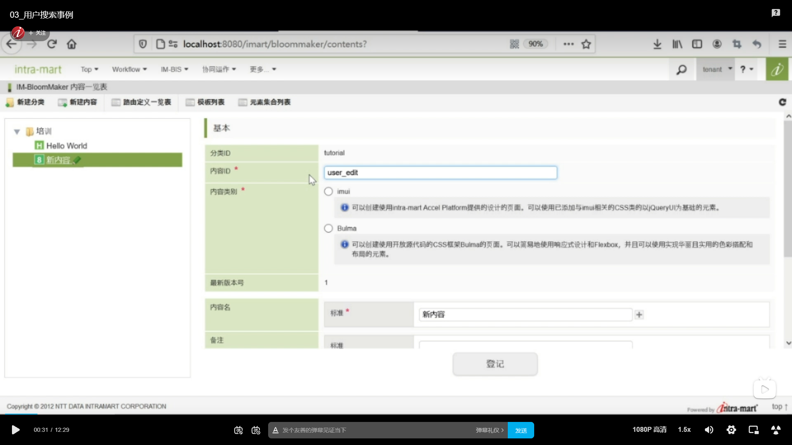
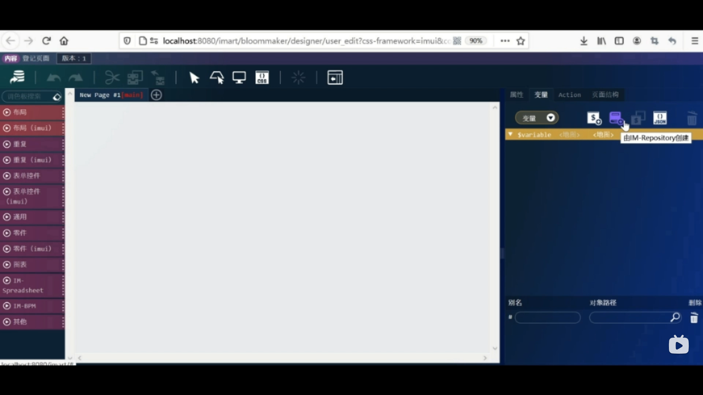
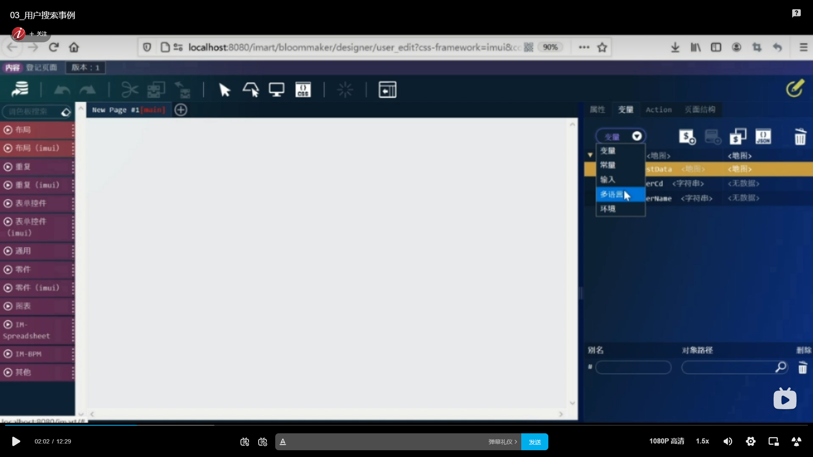
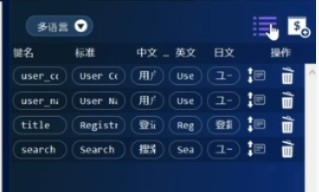
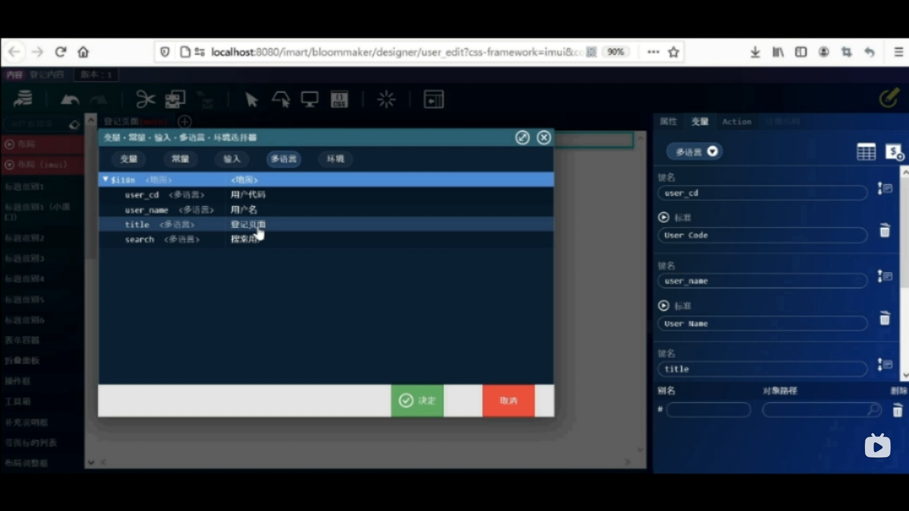
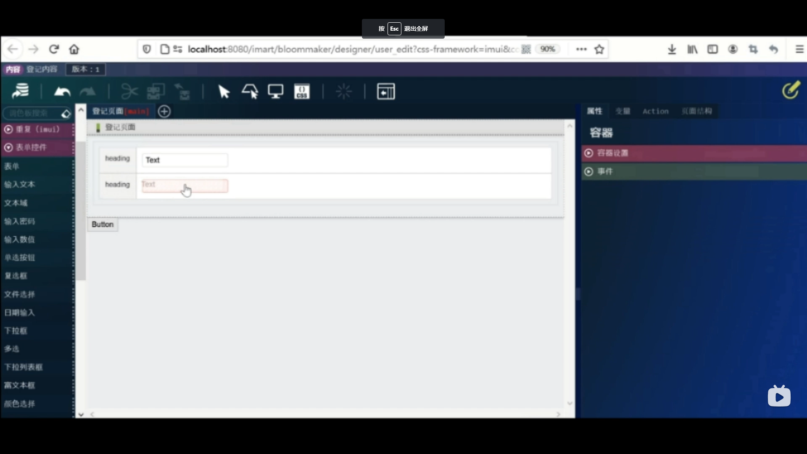
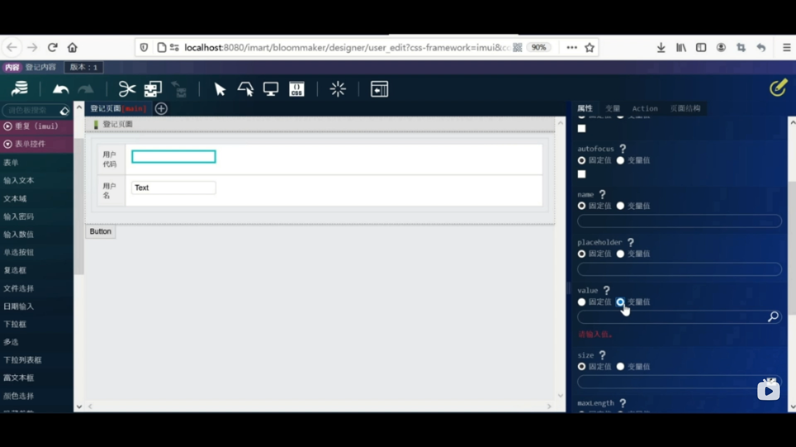
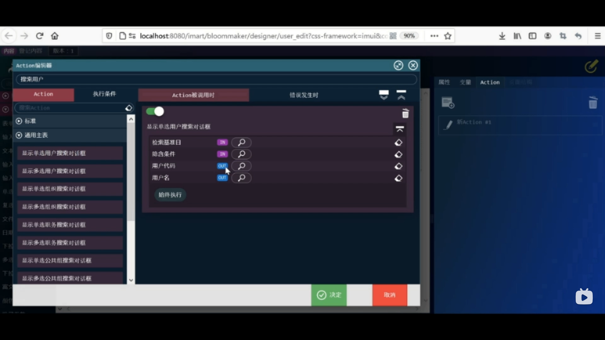
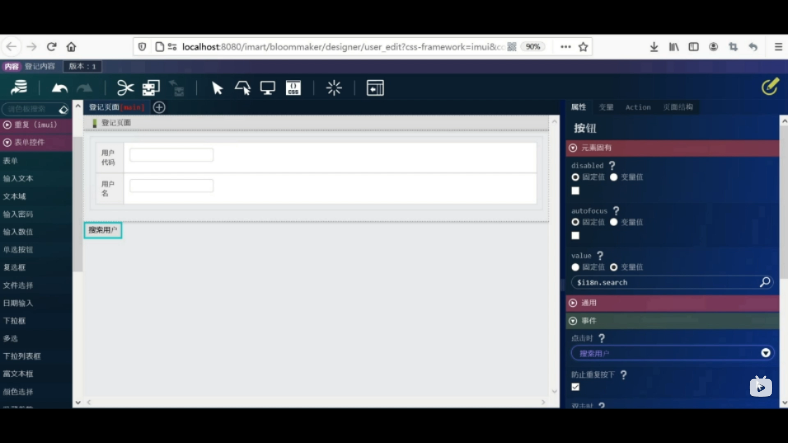
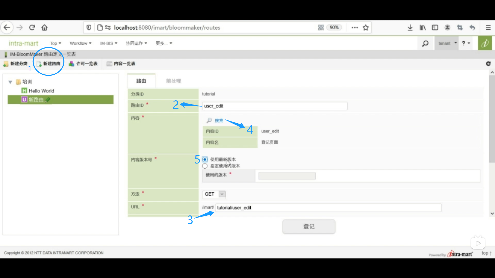

1. 新建内容
网站地图 --> BloomMaker --> 内容一览表 --> 选中创建好的培训分类 --> 
新建内容 --> 内容ID改为user_edit --> 内容名中输入 “登记页面”
   
 
 2. 设计页面
 点击设计编辑按钮进入设计页面 --> 右侧选项栏 变量 --> 由IM-Repository创建 --> 点击输入实体 --> 选择登记页面 --> 确定
   

3. 修改键名
key1改为requestData --> 变量下拉框选择多语言 --> 最右侧新建图标 --> 键名输入user_cd --> 标准中输入 “User Code” --> 中英日中分别输入 “用户代码”   “User Code” 和 “ユーザーコード”

   

4. 同样方法为userName title和search设置显示于中日英三种环境的名称 --> 通过新建左侧的表格按钮确认
   

5. 将属性中的元素固有name改为“登记页面” --> 打开布局（imui） --> 拖拽标题类别1至页面上方 --> 固定值改为变量值 --> 点击放大镜图标 --> 选择多语言 --> 选择用于标题的常量title --> 决定

   

 6. 布局中选择框拖拽至页面上方 -->  布局（imui）中选择横向表格拖拽至框内 --> 固有元素中数字改为2 --> 打开表单控件将按钮拖拽至表格下方 --> 拖拽两个输入文本至表格右侧列 --> 

  

7. 选中heading --> 将固有元素改为多语言中的user_cd --> 同样方法第二个heading改为user name

8. 选中第一行的输入文本 --> value改成变量值 --> 放大镜 --> 变量 userCd 
   选中第二行的输入文本 --> value改成变量值 --> 放大镜 --> 变量 userName 
  

9. 修改按键显示名
选中按钮 --> value改成变量值 --> 放大镜 --> 多语言 搜索用户

10. 设置action
新建图标 --> 输入搜索用户 --> 通用主表中选择 显示单选用户搜索对话框 --> 分别点击用户代码和用户名右侧放大镜 --> 选择userCd 和 userName --> 决定
  

11. 为搜索按钮设置动作
点击搜索用户按钮 --> 事件 --> 搜索用户 --> 预览 --> 覆盖保存
 

12. 设置路由和权限 
点击路由定义一览表 --> 新建路由图标 --> 如图所示操作并填写内容 --> 路由名称改为“登记用户” --> 点击登记按钮 
 

13. 设置权限 
点击许可URL右侧的齿轮图标 --> 开始权限设定 -->  认证用户打勾 --> 结束权限设定 

