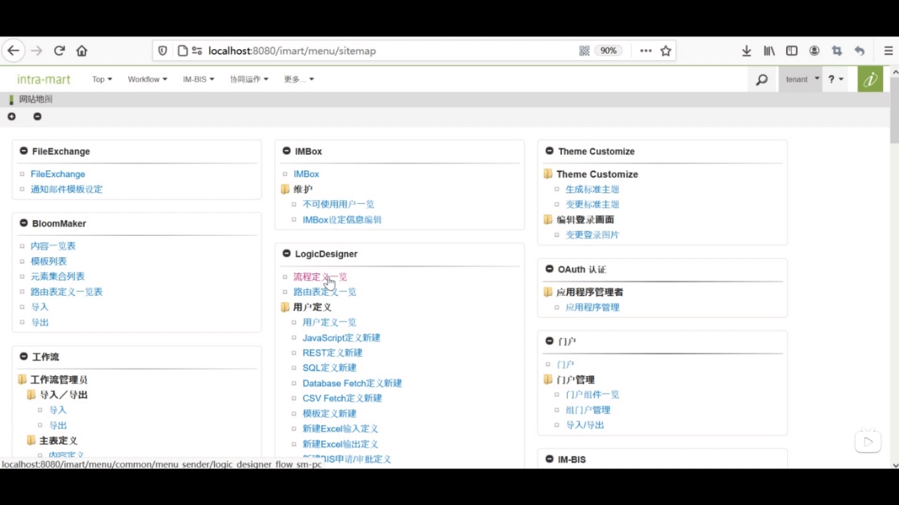

- 在之前的基础上添加一个上传文件的控件和一个登记按钮来登记用户信息

1. 更多 --> tenant管理 --> 数据库操作 
 

2. SQL文件导入 --> 执行 
 

3. 更多 --> 网站地图 --> LogicDesigner 流程定义一览 --> 新建
 

4. 输入输出设备 --> string 如图添加三个并输入对应名称 --> 确定
**由于是登记用户 没有返回值 所以无需设置输出值**
 

5. 常量设置 
常量设置按钮 --> 添加常量 --> 如图输入 --> 确定 

6. 添加用户定义
左侧面板最底下 --> 点击SQL定义新建 --> 分别输入对应内容 

7. 用户类别中点击新建 --> 输入相应内容 --> 登记

8. 将页面下拉至SQL定义处 --> 查询类别改为INSERT --> 点击由表生成查询链接 --> 选择刚刚创建的 tutorial_cst_bloom --> 查询生成 --> 登记

9. 左侧面板 --> 培训 --> 登记用户 -->
 

10. 左侧面板 --> IMBox --> 发布至DirectMessage 
11. 左侧面板 --> 基本 --> 分支
12.  左侧面板 --> IM-BloomMaker --> 登记文件信息
 

### 映射设置
13. 双击登记用户 --> 一一对应 
 

14. 左上角下拉列表框中选择会话信息 --> 添加输入 --> 如图连接 (可以通过会话信息获得执行逻辑时的时间)  
 

15. 右上角下拉列表框中选择identidier --> 添加函数 --> 如图连接 --> 确定
 

16. 双击DirectMessageBox --> 如图连接 --> 左上角下拉列表框中选择账户Context --> 添加输入 --> 如图连接 （可以通过账户context从登录用户信息中来获得发送方的用户信息） --> 确定
 
 

17. 分支条件
双击分支 --> 点击编辑图标 -->  如图输入表达式 --> 关闭窗口
 

18. 登记文件信息
双击登记文件信息 --> fliekey 连接 key --> 确定

19. 新保存
点击左上角 新保存 图标 --> 定义ID "user_register" 定义名 标准 “登记用户” --> 点击类别中的新建 --> 定义ID "tutorial" 定义名 标准 “培训” -->  确定
 

### 设置路由供BloomMaker调用时使用
20. 更多 --> 网站地图 --> 路由表定义一览 --> 新建 --> 对象流程中检索 
 

21. 填写ID --> 登记
 

22. 设置许可
点击等级用户右侧的许可图标 --> 开启权限设定 --> 认证用户 --> 关闭窗口

### 制作页面
23. 网站地图 --> 内容一览表 --> 培训 --> 登记页面 --> 设计编辑 

24. 变量  filekey作为用来保存识别文件的键
 

25. 变量改为常量 --> 新建图标 --> 键名改为"Id_register" --> 选中固定字符串 --> 输入URL --> 决定
 

26. 再设置一个常量 --> 决定
 

27. 常量改为多语言 -->  表格模式 --> 添加button和file
 

28. 布局（imui）--> 表单容器 --> 框拖拽至级别2下方 --> 标题级别2拖拽至框的下方 --> rowCount改为1 --> 标题分别改为搜索用户和文件信息
 

29. 表单控件（imui） --> 按钮拖拽至表格下方 --> value 修改为多语言中设置好的登记 --> 决定

30. 文件信息 外边距改为10px --> 表单控件中的文件上传拖拽至文件信息表格内 --> heading改为多语言中文件信息
 

31. action --> 新建 
 

32. 放大镜 --> 常量
 

33. 方法修改为POST --> 请求数据选择requsetData

34. imui 显示信息拖拽至右侧 --> 显示信息放大镜 --> 常量msg --> 勾选点击即可关闭 --> 决定
 

35. 设置显示条件 --> 事件 点击时 等级处理 
 

36. 文件上传按钮中的 value 点击放大镜 --> 变量下的filekey --> 覆盖保存 

37. 选择表一览 --> 输入tutorial_cst_bloom --> 检索 
 
