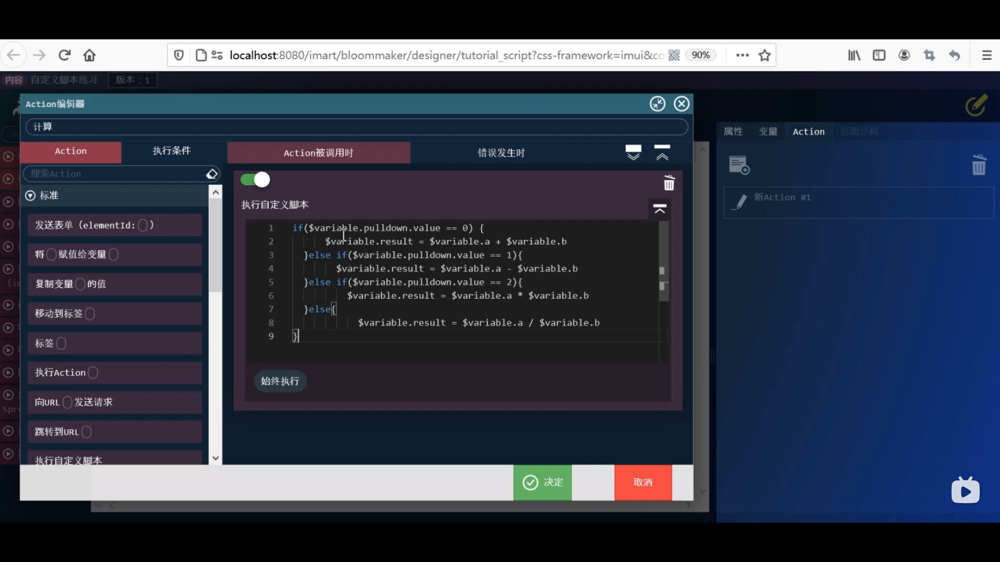

1. BloomMaker 内容一览表菜单 --> 新建内容 --> 填写相应内容 --> 选择imui
 

2. 设计编辑 开始设计 --> 布局（imui） --> 标题级别1  --> 固有值改为自定义脚本练习 

3. 表单容器拖拽至页面 --> 删除标题外所有部件 --> 固有值改为变量操作 

4. 表单控件 --> 输入数值 两个 --> 下拉框 放在两个之间 

5. 通用下拉框 --> 选中一个标签拖拽至最右侧 --> 固定值改为= --> 拖拽两个框如图所示

 

6. 表单 --> 按钮 至第一个框中--> 固定值改为计算 --> 外边距上 10px  --> 输入数值 至第二个框中 

### 设置变量
7. 变量 --> 新建 如图 --> 决定
 

8. 选中pulldown 如图 --> 设置labels
 

9. 设置第二个 --> values
 

10. 设置第三个 --> value
 

11. 点击labels的0 --> 固定字符串赋值+ --> 另外三分别是-*/
 

11. 点击values的0 --> 固定字符串赋值0 --> 另外三分别是123

12. variable中新建  --> 同样方法设置 a,b,result --> 变量设置完毕
 

### 配置变量
13. 点击文本框 --> 属性选项卡 --> 元素固有的value 改为 变量值 --> 放大镜选择a 另外两个同样
14. 点击下拉框 --> 属性选项卡 --> 元素固有的labels 改为 变量值 --> 放大镜选择labels --> values 改为 变量值 --> 放大镜选择values  --> value 改为 变量值 --> 放大镜选择value 

### 配置action
15. 新建 --> 输入计算 --> 选项卡执行自定义脚本
 

16. 左上角执行条件 --> 标准 --> 变量xx不是xx时 --> 变量放大镜 选择value --> 决定

### 设置事件
17. 点击计算按钮 --> 右侧属性 --> 事件 选择计算 --> 覆盖保存 

### 设置路由和权限 
18. 路由定义一览表 --> 培训 --> 输入相应内容 --> 搜索 --> 自定义脚本练习 --> 输入URL tutorial/tutorial_script
 

19. 设置权限
许可URL右侧齿轮图标 
