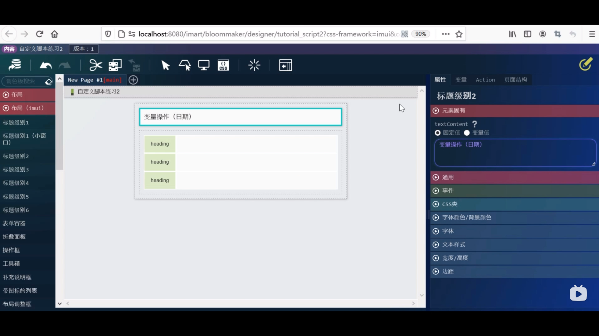
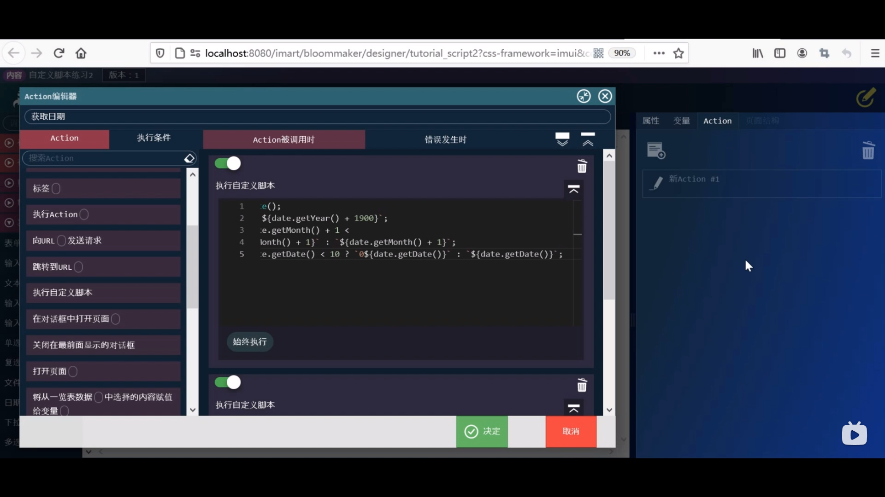

1. 内容一览表 --> 培训分类 --> 新建内容 --> 输入对应内容
 

### 设计编辑
2. 布局（imui）--> 标记级别1 拖拽 --> 属性 固定值 自定义脚本练习2

3. 表单容器 --> rowCount修改为2 --> 第一个heading的textContent改为获取日期 --> 第二个heading的textContent改为正则表达式
 

4. 表单控件下拉框 --> 两个输入文本 --> 页面设置完毕

### 设置变量
5. 新建变量 yyyy --> 相同方法 三个 MM dd today
 

### 设置action
6. 新建action 获取日期 --> 两个执行自定义脚本 
 

7. 脚本1 
 

8. 获取日期文本框 --> 属性 --> value 选择变量值 --> 输入“=” 点击放大镜  --> 选择yyyy + MM + dd
 

9. 正则表达式本框 --> 属性 --> value 选择变量值 -->  点击放大镜  --> today

10. 选择容器 --> 如图 --> 覆盖保存
 

11. 路由定义一览表 --> 培训 --> 新建路由 --> 输入相应内容 --> 搜索 --> 自定义脚本练习2 --> 输入URL tutorial/tutorial_script2
 