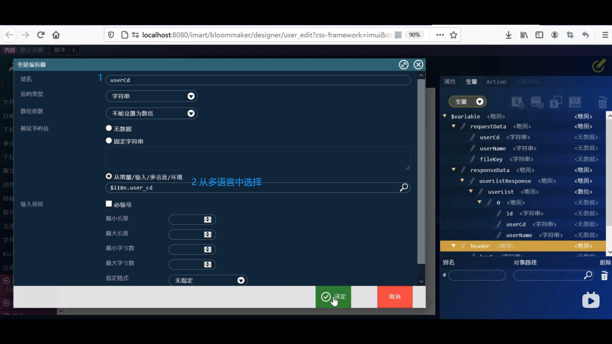

1. 网站地图 --> 内容一览表 --> 培训 --> 登记页面 --> 设计编辑

2. 新建页面 --> name重命名 --> 通过容器设置为主页面
 

3. 从列表页面复制 
 

4. 删除纵向表格 --> 表单控件中添加richTable --> 
 

5. 点击变量 --> 新建 --> 如图 
 

6. 新建 键名为 index  值的类型 字符串 --> 决定

7. 选中header 新建下级变量 --> 如图
 

8. 同样方法添加 userName

9. 设置属性 --> 覆盖保存
 

