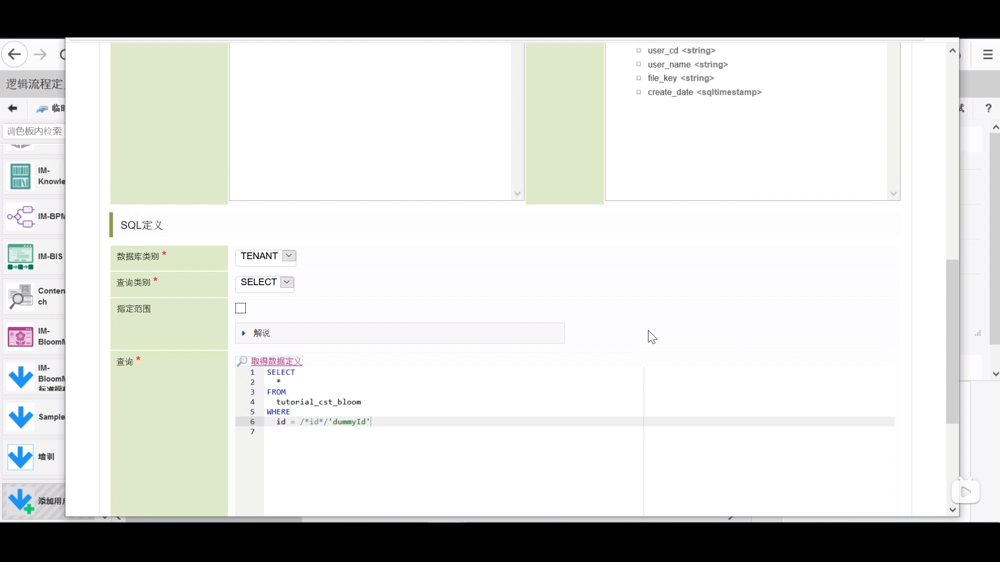
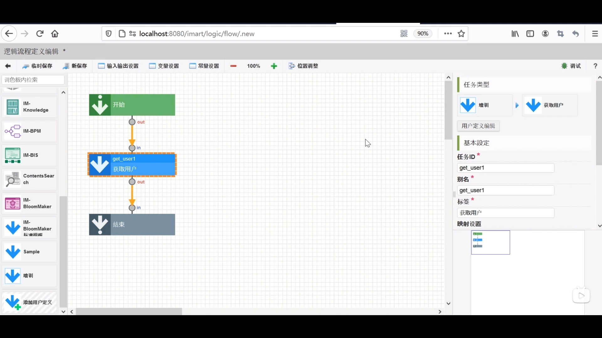

1. 网站地图 --> 流程定义一览 --> 新建 --> 输入输出设置 --> 如图（注意：3配置在下级）
 

2. 左侧列表添加用户定义 --> SQL定义新建 

3. 共通设定如图 --> 检索中选择培训 
 

4. 查询中如图修改 --> 取得数据定义 
 

5. 上面的输入值中删除现有的两个 --> 如图添加 --> 登记
 

6. 培训 --> 获取用户 --> 点击 id连接id

7. 点击结束按钮 --> 如图 添加输入并连线 --> 确定

8. 新保存 

9. 设置路由 
路由表一览 --> 新建 --> 检索中选择 get_user --> 如图 --> 设置许可 

### 开始制作页面 
10. 网站地图 --> 内容一览表 --> 培训 --> 登记页面 --> 设计编辑

11. 新建页面并命名为“编辑页面”

12. 将登记页面的内容复制至编辑页面

13. 点击标题级别1 --> 如图修改变量值

 14. 修改登记按钮 --> value中的值改为edit

 15. 删除搜索用户按钮 --> 页面修改完成

### 开始新建变量
 16. 新建变量 命名为editUrl --> 决定

 17. responseData中新建 --> 如图 

18. userEditResponse中新建 --> 内容如图

19. 在user中新建变量 命名为userCd --> 同样方法新建userName和fileKey 

### 开始新建常量
20. 如图新建常量Id_get_user 

21. 修改用户代码右侧的对话框的value值 （注意是userEditResponse下的userCd） --> 同样方法设置用户名和文件上传

### 设置列表页面跳转至编辑页面的action
22. 新建action --> 如图添加脚本

23. 拖拽向URL发送请求至下方 --> 放大镜 --> 选择最下的editUrl --> 决定 --> 响应数据选择userEditResponse

24. 拖拽打开页面至下方 --> 选择编辑页面 --> 决定

### 设置返回列表页面的action
25. 新建action --> 如图 

26. 显示工具栏打勾

27. 设置返回按钮

