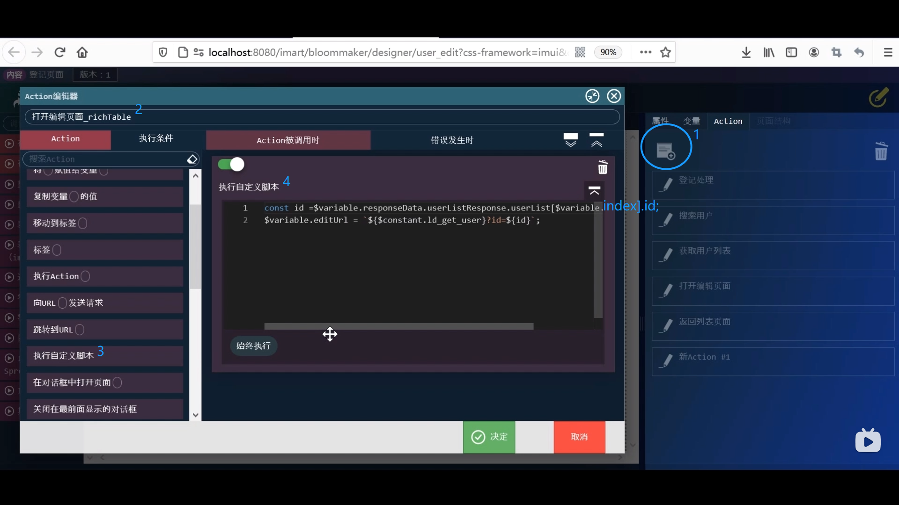
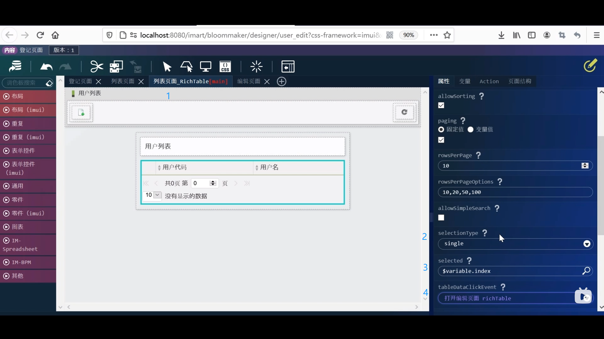

1. 网站地图 --> 内容一览表 --> 培训 --> 登记页面 --> 设计编辑

2. 将列表页面_RichTable设置为主页面 --> action选项卡新建 --> 如图添加脚本

3. 拖拽向URL发送请求至下方 --> 放大镜 --> 选择最下的editUrl --> 决定 --> 响应数据选择userEditResponse

4. 拖拽打开页面至下方 --> 选择编辑页面 --> 决定

5. 点击Rich_Table并如图依次设置 --> 覆盖保存

