1. 网站地图 --> 流程定义一览 --> 新建 

2.  输入输出设置 -->  设置三个string(注意:需要和requsetData下的变量名一致)
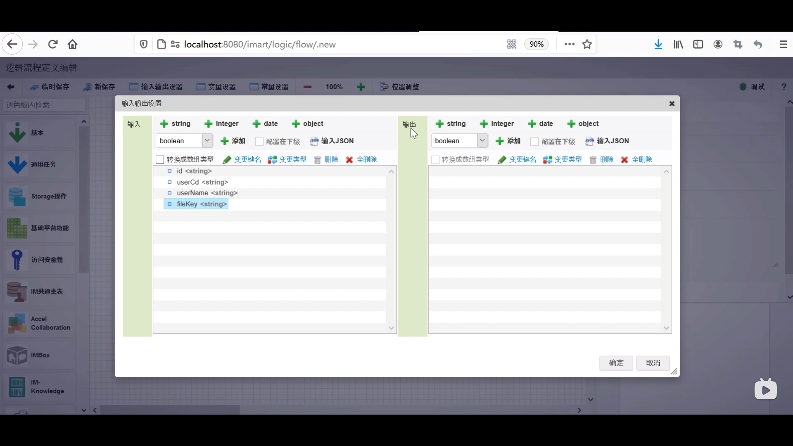

3. 常量设置 --> 添加常量 --> ID:msg 常量值：编辑已完成

4. 左侧列表添加用户定义 --> SQL定义新建 
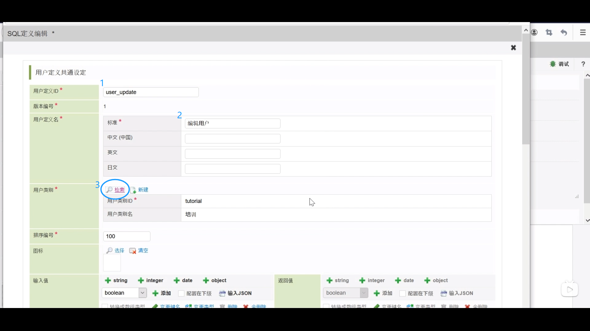

5. 将查询类别修改为UPDATE --> 点击由表生成查询 寻找“tutorial_cst_bloom” --> 将输入值中自动生成的createDate删除 --> 登记

6. 新建编辑用户 --> 添加基本中的分支 --> 添加BloomMaker中的登记文件信息 
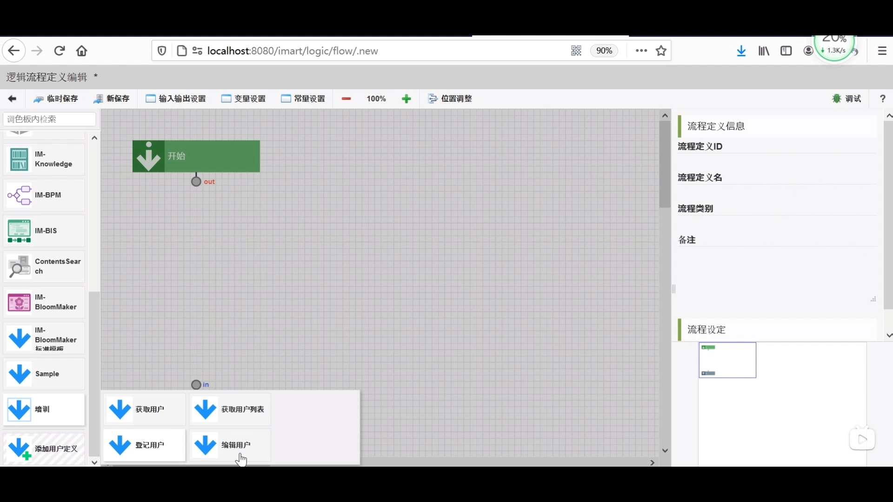

7. 如图连接
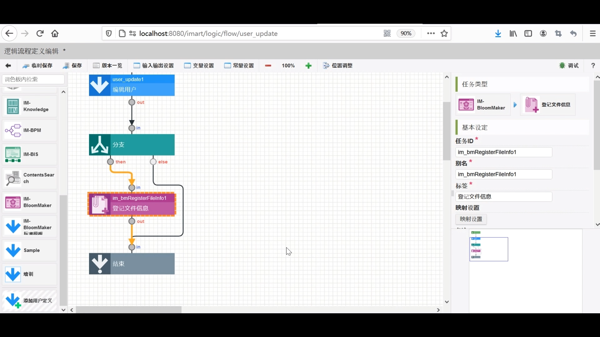

### 映射设置
8. 双击编辑用户 --> 如图
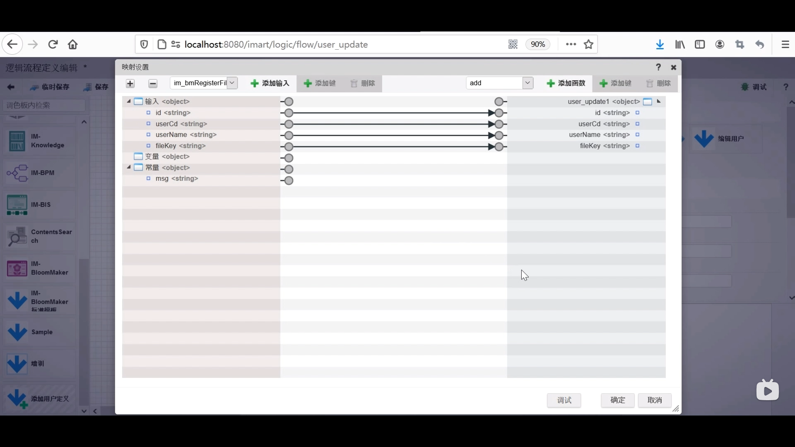

9. 双击登记文件信息 --> 如图 （将识别文件的唯一键传递给登记文件信息元素 可以获得文件信息）
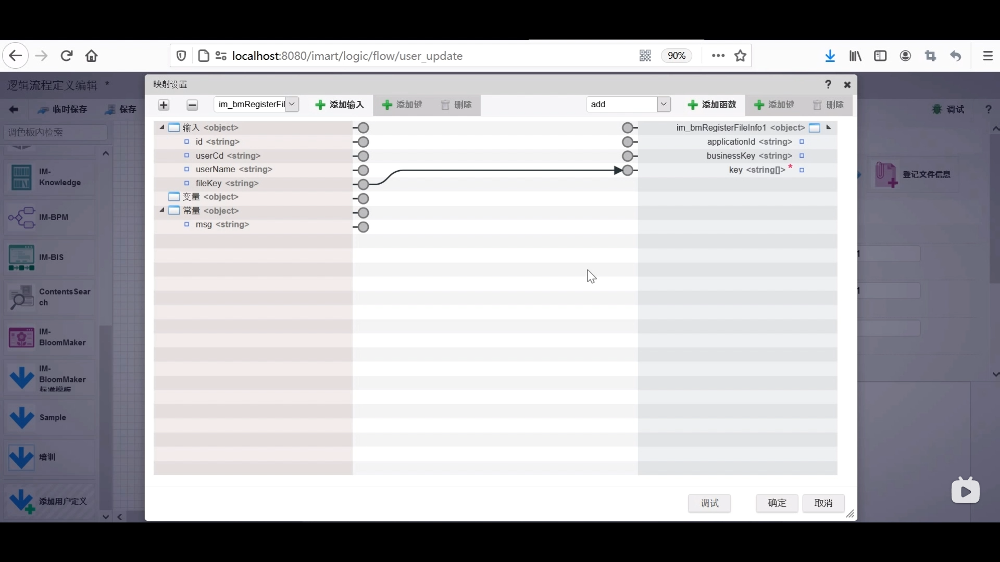

10. 选中分支 --> 添加表达式（只有当文件上传时才处理的表达式） 
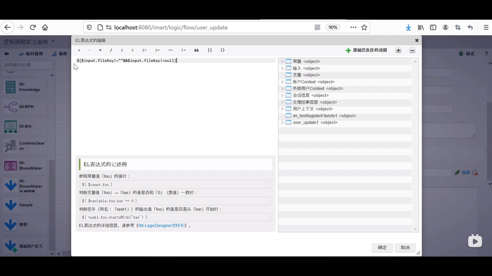

11. 新保存  
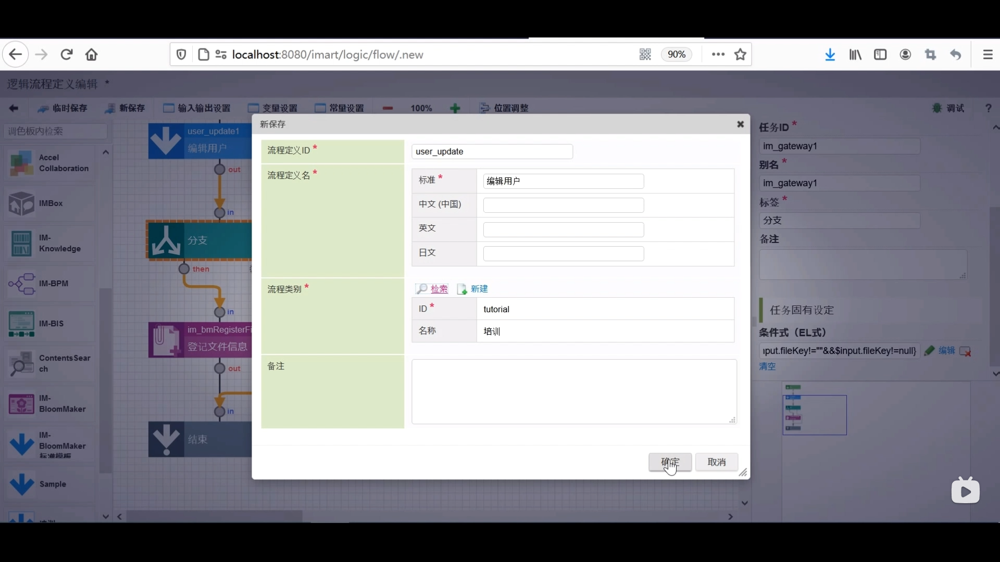

12. 设置路由  
路由表定义一览 --> 新建 --> 寻找刚刚设置好的编辑用户 --> 如图 --> 设置许可 认证用户
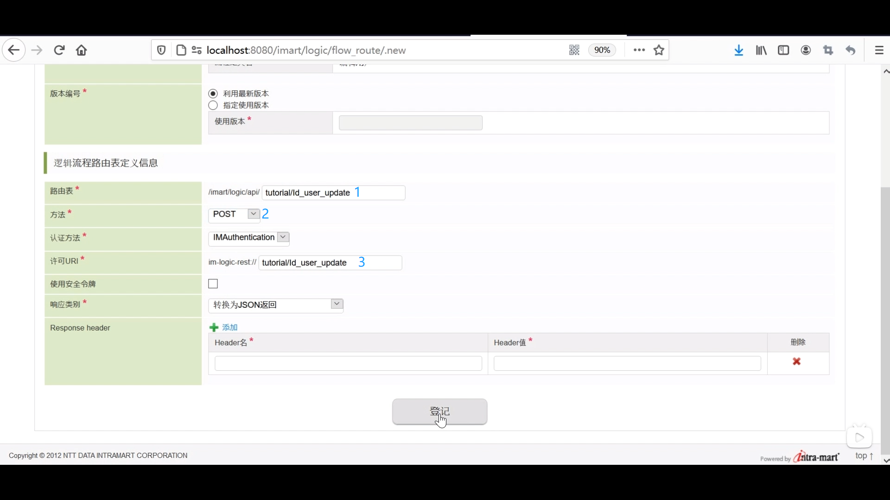

### 制作页面
13. 内容一览表 --> 培训 --> 登记页面 --> 设计编辑

14. 变量选项卡 --> 点击requestData 新建 --> 命名为id

15. 常量选项卡 -->  如图
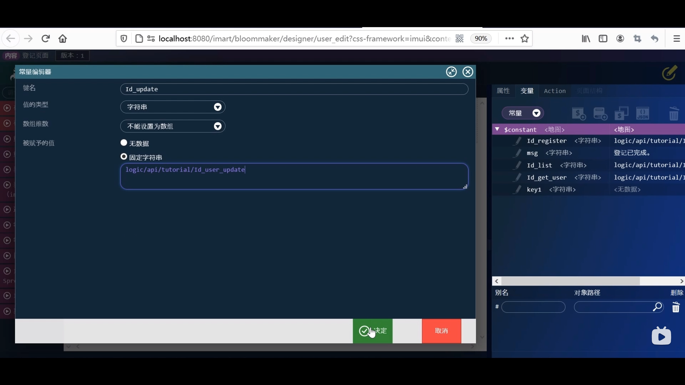

16. 再次新建常量 --> 键名msg2 被赋予的值 “编辑已完成”

17. action选项卡 --> 新建 “编辑处理”
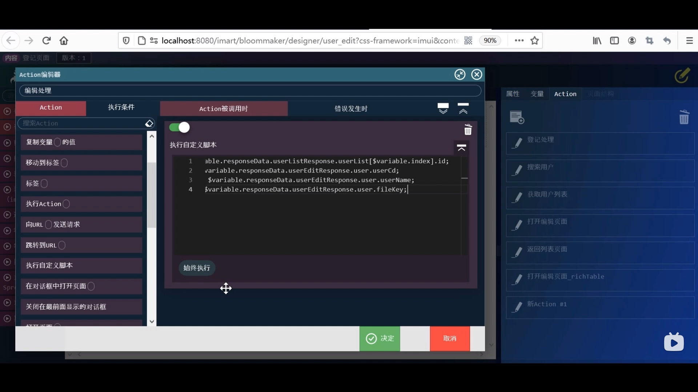

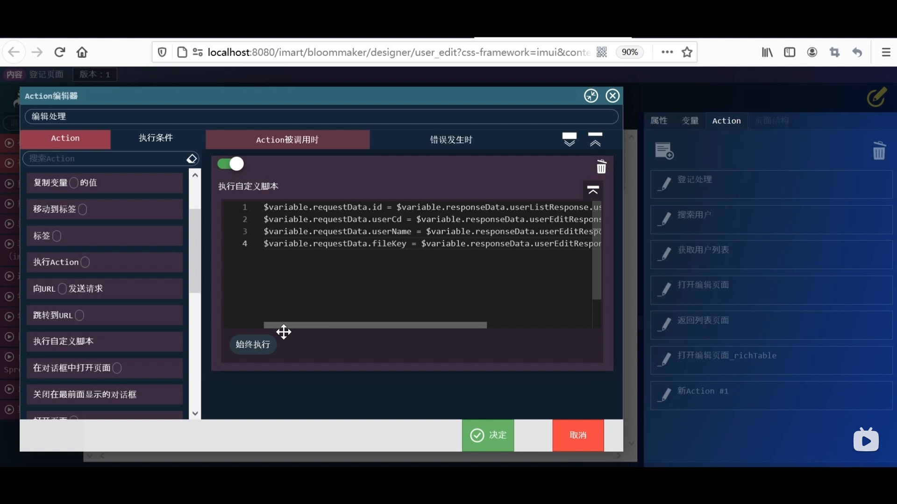

18. 拖拽向URL发送请求至下方 --> 放大镜 --> 选择常量中的Id_update --> 方法修改为POST --> 请求数据 放大镜 --> 变量中的requestData 

19. 左侧imui下拉框 --> 拖拽显示信息至页面 --> 显示信息放大镜 -->  选择常量中的msg2 --> 勾选点击即可关闭的标志

20. 回到编辑页面 --> 点击编辑按钮 --> 事件 --> 点击时 选择编辑处理 --> disabled中的数值删除 --> 覆盖保存

