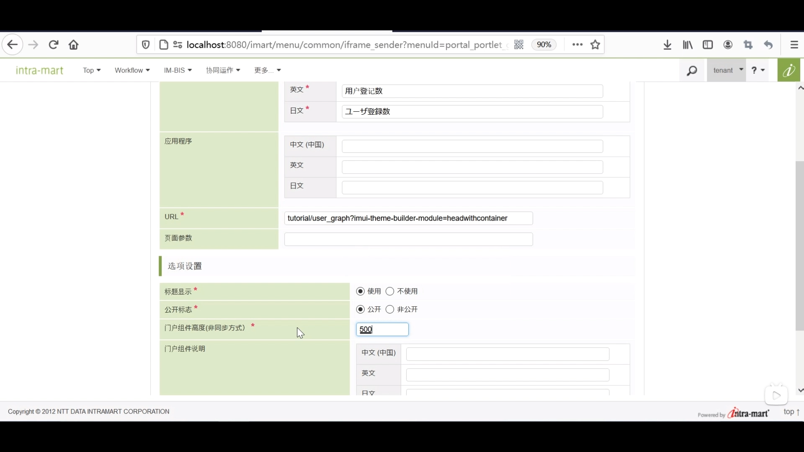

### 本次要创建两个逻辑流程 
- 获取要显示在饼状图中的数据的逻辑流程 
- 用于获取要显示在饼状图表之外的其他图表中数据的逻辑流程

1. 流程定义一览 --> 新建 --> 输入输出设置 --> 输出部分新建object --> 如图新建下级 

2. 左侧新建添加用户定义中的SQL定义新建 --> 如图

3. 查询中输入图中内容 --> 取得数据定义 --> 删除输入值中内容 

4. 左侧新建培训中的获取重复用户 --> 由上自下连接 

5. 双击结束按钮 --> 如图连接

6. 新保存

7. 输入输出设置 --> 输出部分新建object --> 如图新建四个

8. 常量设置 --> 添加常量 --> ID：name 常量值：每日登记次数  

9. 左侧新建添加用户定义中的SQL定义新建 --> 如图

10. 查询中输入图中内容 --> 取得数据定义 --> 删除输入值中内容

11. 添加用户定义 --> javaScript定义新建 --> 

12. 删除并重新配置输入值

13. 重写JavaScript定义

14. 左侧新建培训中的获取每日登记次数和图表结果数值操作 --> 依次连接

15. 双击图表结果数值操作 --> 添加输入并连接

16. 新保存 

17. 设置路由 
路由表定义一览 --> 如图新建 --> 同样方法新建饼状图 --> 设置许可 认证用户

18. 网站地图 --> 内容一览表 --> 培训 --> 新建内容 --> 如图 --> 设计编辑

### 新建图标页面
19. 布局（imui） --> 标题级别1 --> 属性 固定值修改为图表显示

20. 图标下拉框中饼图拖拽至右侧 --> 拖拽折线，柱状，雷达 --> 全部外边距上改为20px

####设置变量
21. 变量 --> 如图新建 --> 

22. 在responseData中新建 

23. 再新建data

24. 选中0 新建 键名：name
25. 选中0 新建 键名：y  类型选择整数

26. 点击responseData新建

27. otherresponse新建

28. 继续新建

29. 从0中新建

30. 再次选中0 新建 键名：name

#### 设置常量
31. 新建常量

32. 再次新建

#### 设置action
33. 新建action --> 如图同样设置其他图形

34. 容器 --> 页面标题 改为显示图表 --> 事件 --> 读取页面时 获取图表 

35. 饼图属性设置 

36. 折线图属性设置 --> 选择最下的createData --> series选择series

37. 柱状图属性设置 --> 选择最下的createData --> series选择series

38. 同理设置雷达图

39. 标题页面 --> 勾选防止重复按下 --> iconClass设置为new --> 修改href

40. 设置路由  
路由表定义一览 --> 培训中新建 --> 寻找刚刚设置好的编辑用户 --> 如图 --> 设置许可 认证用户

### 登记到门户用户
41. 更多 --> Tenant管理 --> 门户管理 --> 门户组件一览中新建 --> 非同步方式门户组件 --> 如图 --> 设置许可 认证用户

42. 更多 --> Tenant管理 --> 门户管理 --> 组门户管理 --> 删除所有内容 --> 组件添加 

43. 组织门户 --> 访问权设置 --> 设置许可 认证用户

