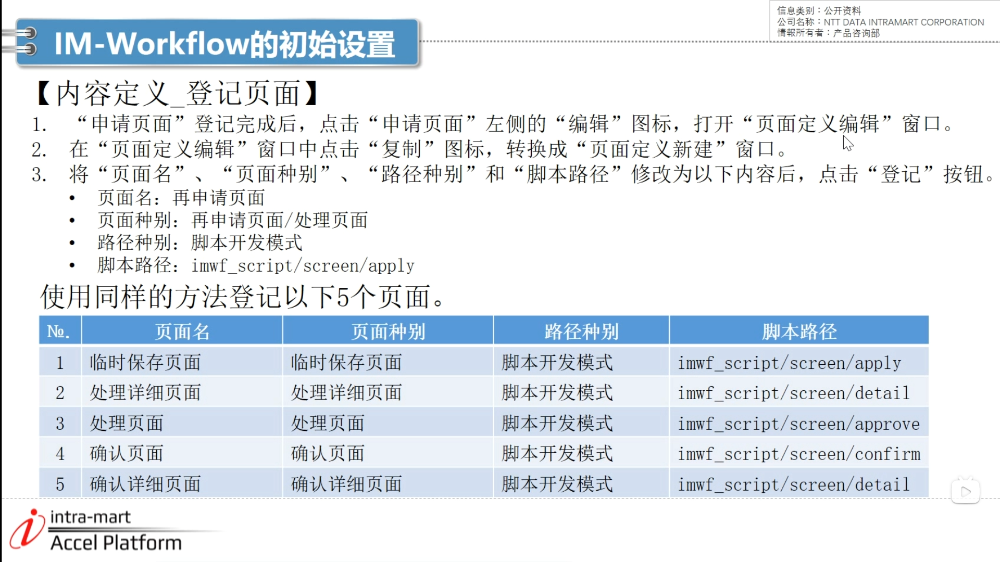

####  IM-Workflow的初始设置

1. 文件 --> 新建 --> 项目 --> 选择Module project --> 项目名

2. 如图选择属性

3. 复制初始程序 --> 复制src文件夹黏贴至wfscript中 --> 点击全部为是

4. 服务器右键 --> 添加和移除 --> 添加 --> 关闭后启动

5. 网页地址 没有密码

6. 用户菜单 --> 检索 --> 点击青柳左侧的编辑 --> 身份 --> 添加 --> 检索 IM-Workflow管理员 --> 确定 更新 --> 右上角退出

  
7. API文档

8. 设置工作流

9. 内容定义

10. 网站地图 --> 工作流 --> 内容定义 --> 新建 ——-> 登记

11. 在编辑页面新建 --> 版本期间内选择开始日期 --> 更新 

12. 点击基本信息右侧的画面 --> 新建 如图

13. 登记页面

14. 复制页面 同样方法登记5个 （处理详情的apply改成detail 处理的apply改成approve 确认改成confirm）

15. 登记用户程序

16. 用户程序新建 --> 执行顺序填1

17. 路径定义 

18. 用户信息和组织信息

19. 网站地图 --> 主数据定义中的路径定义 --> 版本期间内选择开始日期 --> 登记

20. 如图添加并检索 --> 节点名改为样例科11

21. 点击第一个审批

22. 流程定义

23. 网站地图 --> 主数据定义中的流程定义 --> 新建 --> 版本期间内选择开始日期 --> 内容和路径选择之前创建的内容 --> 登记

