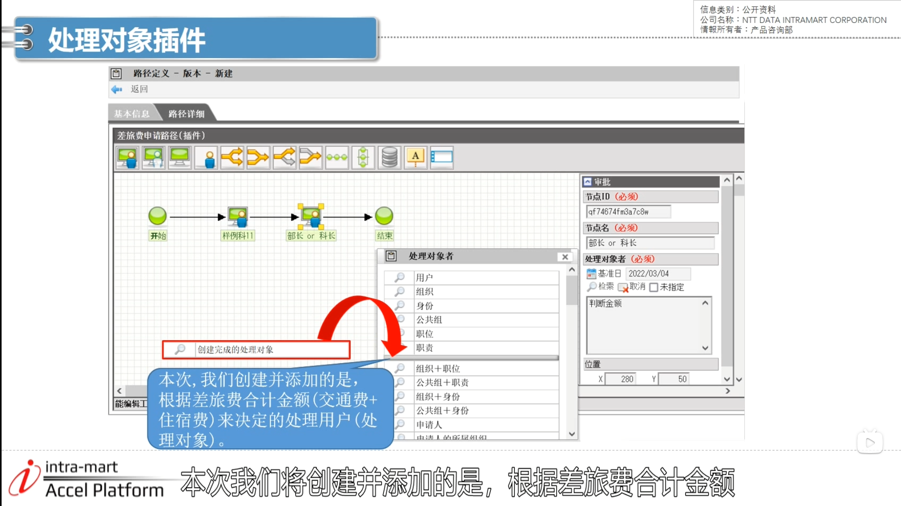
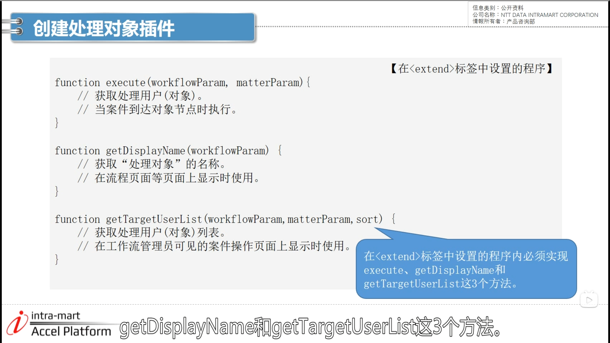

### 处理对象插件
- 本次内容

- 创建并添加一个处理对象，判断是否大于等于3w

### 配置文件
1. 打开src下的plugin文件夹的 plugin.xml

- 对应金额判定

####需要实现的三个方法

1. 方法1

2. 方法2

3. 方法3

- 三个方法总结

### 创建处理对象插件
2. 登录账号 --> 左下角网站地图 --> 工作流 --> 主数据定义下的路径定义 --> 新建 --> 路径详细 --> 添加审批节点 --> 连接

3. 显示名和处理对象都设置为样例11

4. 设置审批节点
点击处理对象栏下的搜索图标 --> 最下面的判断金额 --> 节点名设置为“部长或科长”

5. 工作流 --> 主数据定义下的流程定义 --> 新建连接 --> trip_script_05 --> 进入流程定义-编辑页面 点击新建 --> 内容路径选择script开发和插件 --> 登记

6. 工作流 --> 案件一览表 --> 点击已处理未完成图标 --> 选中插件流程 --> 已经显示在了右侧 --> 点击流程图标 --> 案件已移动至“部长或科长”节点 --> 点击判断金额

### 重点内容

### 参考文档

