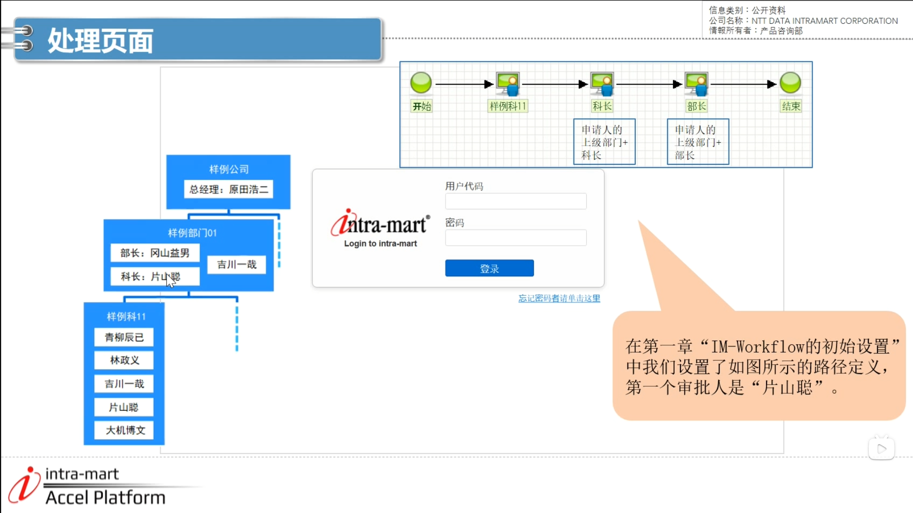
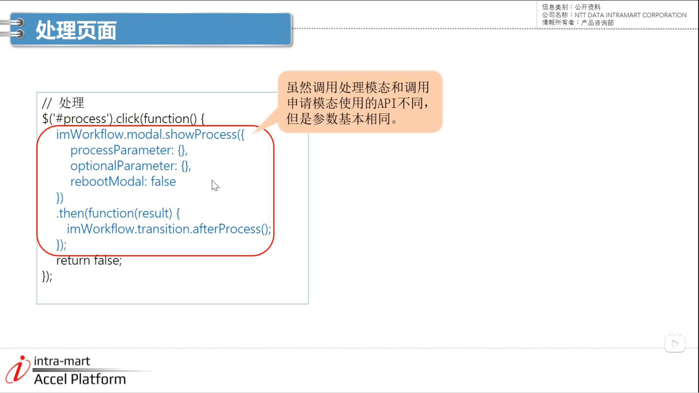
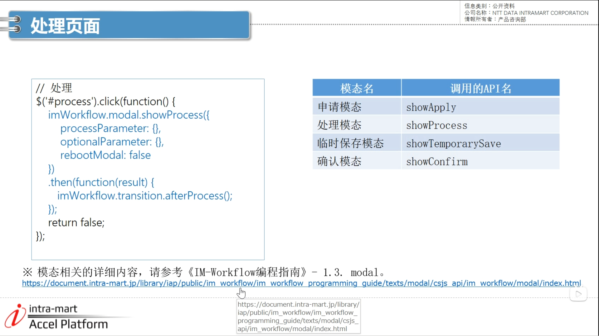
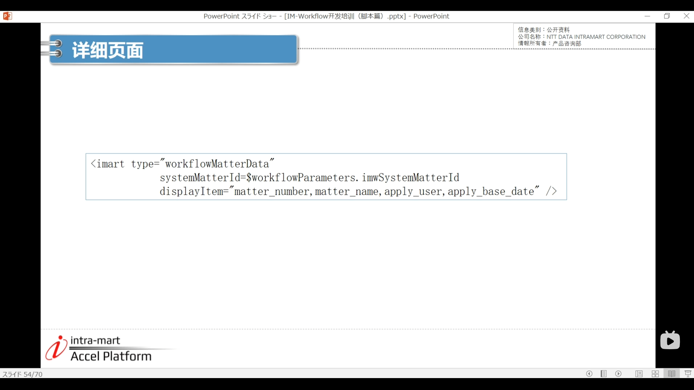
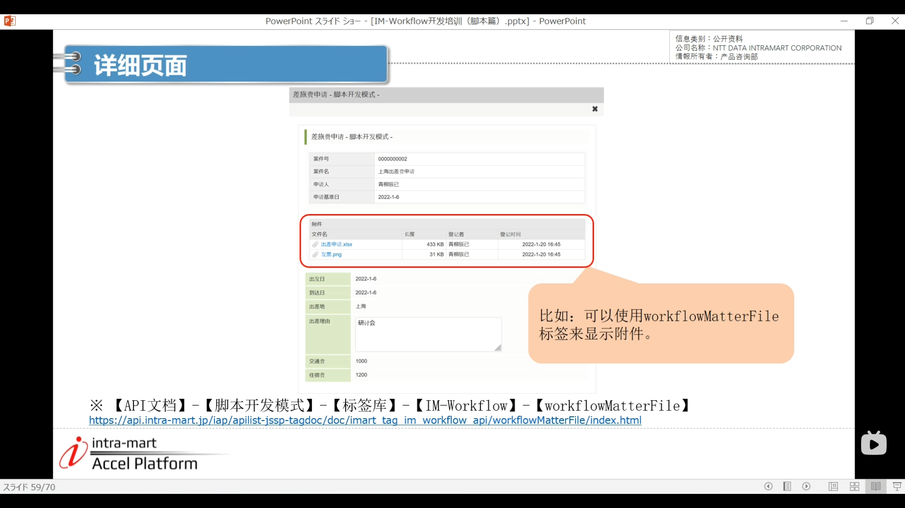
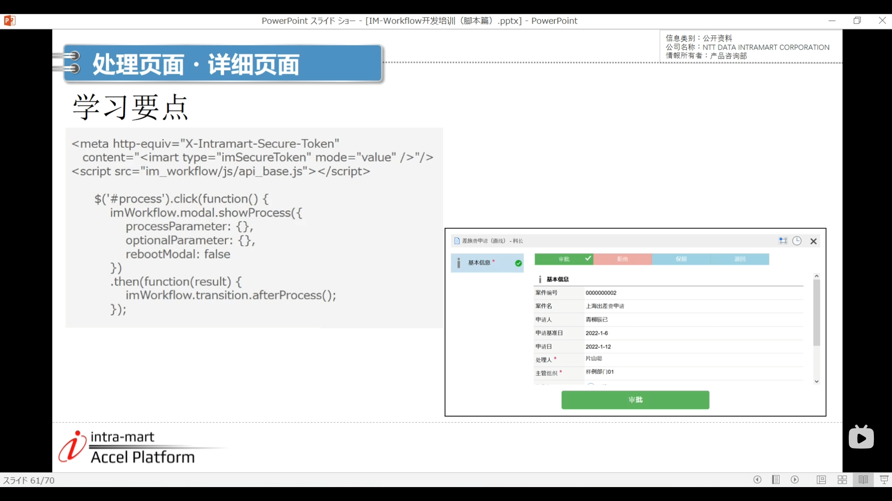

#### 1 处理页面

1. 用片山聪登录 （katayama）--> wrokflow --> 案件一览表 --> 未处理 差旅费申请 --> 点击第一个处理 --> 处理模态页面类似于申请模态页面 

2. API不同，但是参数基本相同

模态相关详细内容

#### 2 详细页面
3. 详细页面添加语句 
- 第一行是用来显示案件信息的标签
- 第二行是设置要显示的案件的系统案件ID 在点击详细内容时获取传递过来的信息
- 在displayItem属性中设置要显示的案件编号及案件名等项目，用逗号区分

matterFile

#### 3 学习要点

