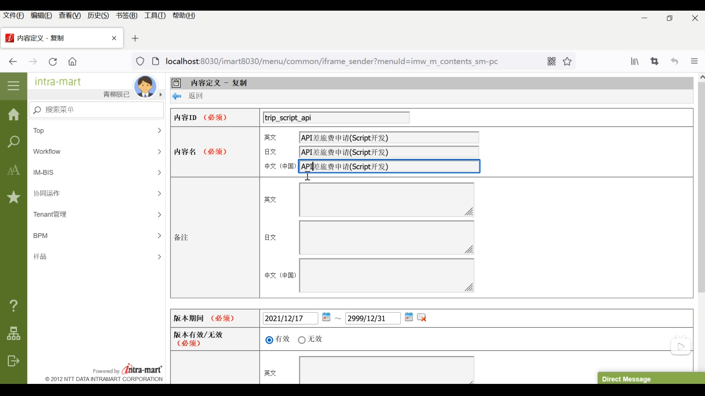
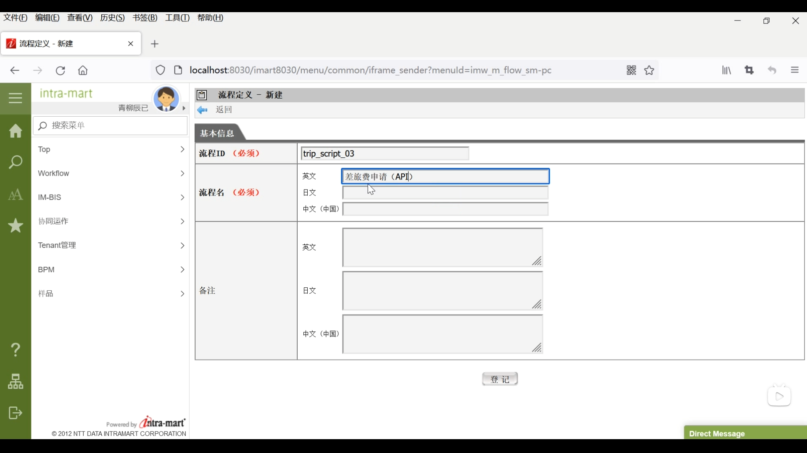
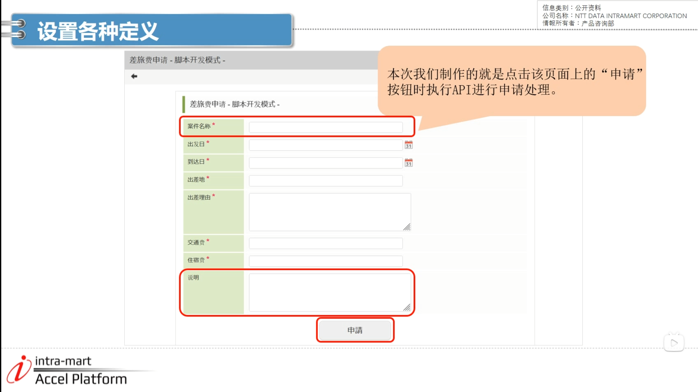
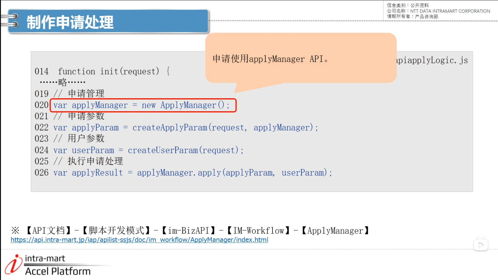
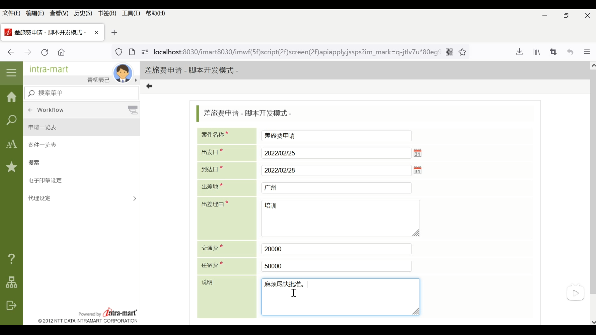
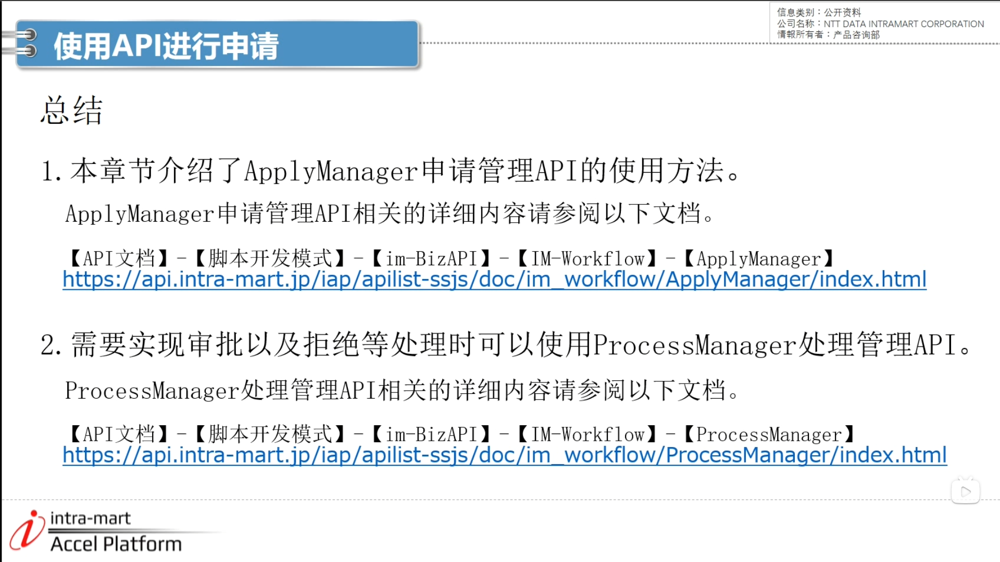

### 设置各种定义
如何不使用申请模态进行申请？ API申请  

1. 登录账号 --> 左下角网站地图 --> 工作流 --> 主数据定义下的内容定义 --> 差旅费申请 --> 版本 编辑 --> 内容复制 --> 修改内容并登记  

2. 点击刚刚新建的API图标 --> 编辑 --> 画面 --> 申请画面 --> 脚本路径改为apiapply --> 登记

3. 工作流 --> 主数据定义下的流程定义 --> 新建 --> 登记 --> 再次点击新建 --> 内容路径分别选择刚刚创建好的 --> 登记

4. 本次内容

5. apply.hyml

6. apiapplyLogic.is (如果在事务已开始的情况下使用API，将发生嵌套错误)

7. wrokflow --> 申请一览表 --> 流程 --> 差旅费申请（API）--> 进入脚本开发模式页面 依次填写 --> 

8. wrokflow --> 案件一览表 --> 点击已处理（未完成） --> 选中API --> 详细内容图标检查

9.总结

