### 什么是用户程序
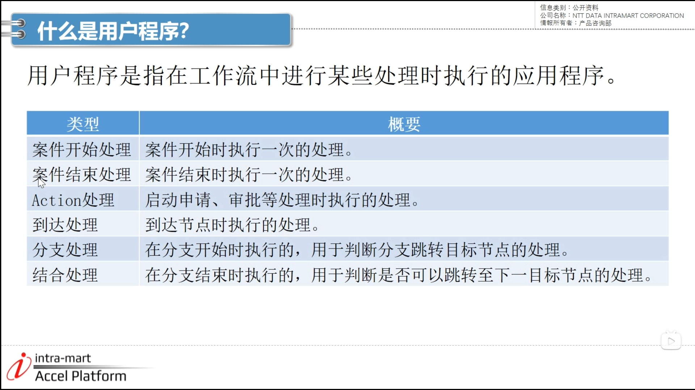

- 案件开始处理
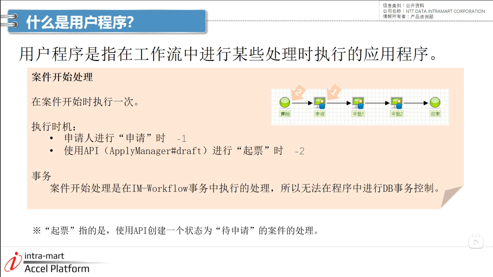

- 案件结束处理
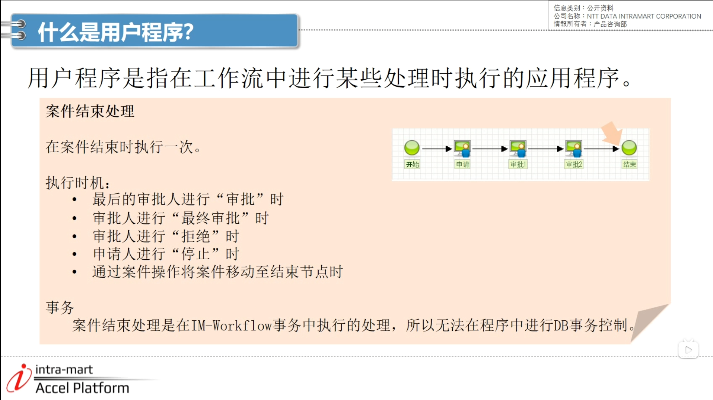

- 案件结束处理（无事务）
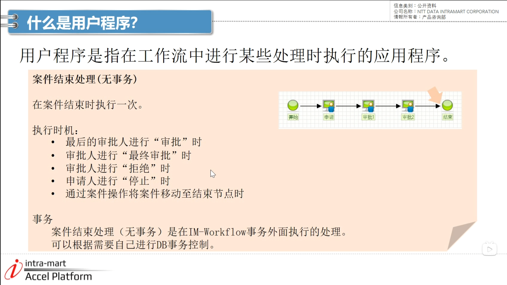

- action处理
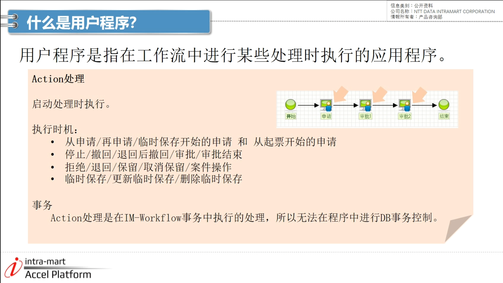

- 到达处理
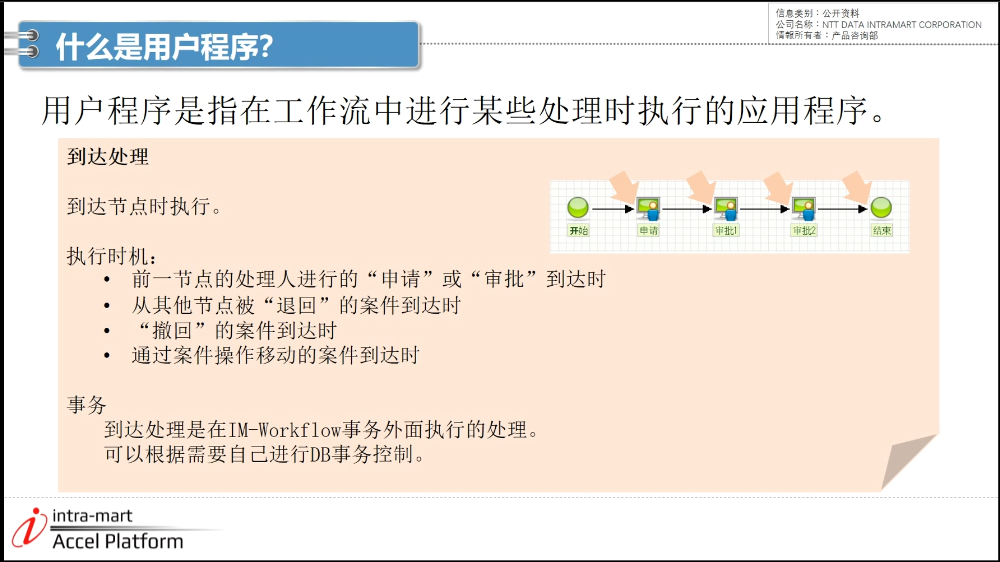

- 分支处理
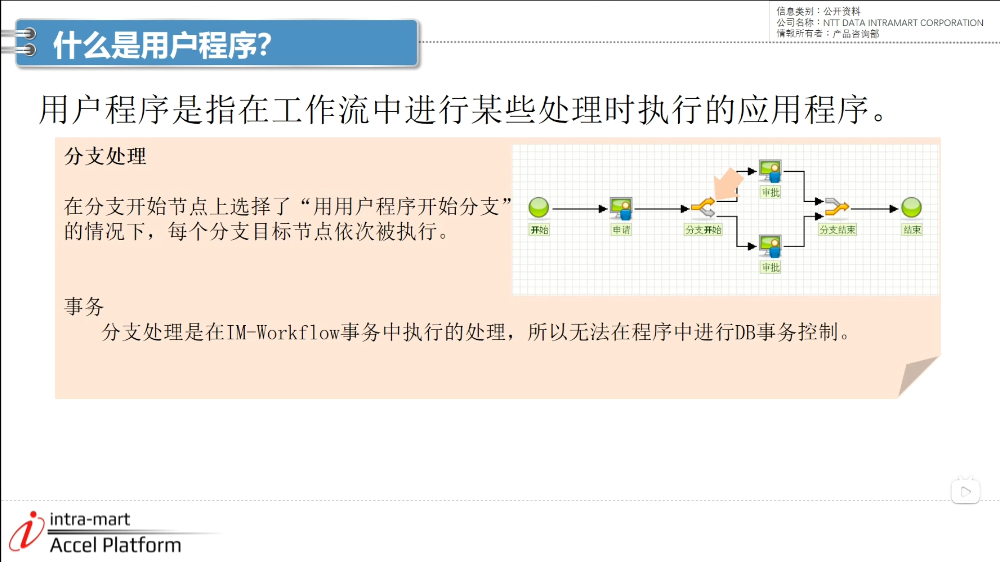

1. 登录账号 --> 左下角网站地图 --> 工作流 --> 主数据定义下的内容定义 --> 差旅费申请 --> 版本 编辑 --> 用户程序 --> 新建并登记  
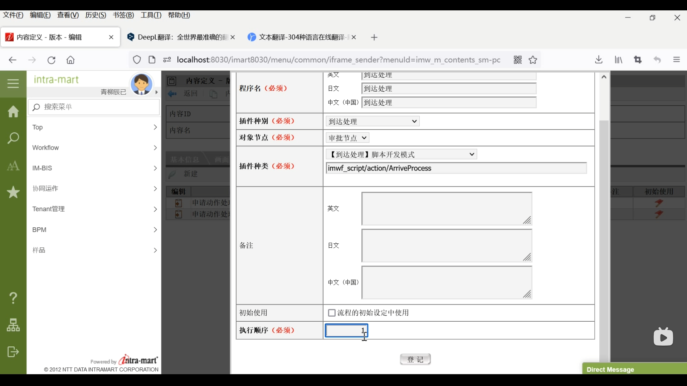

- 注意
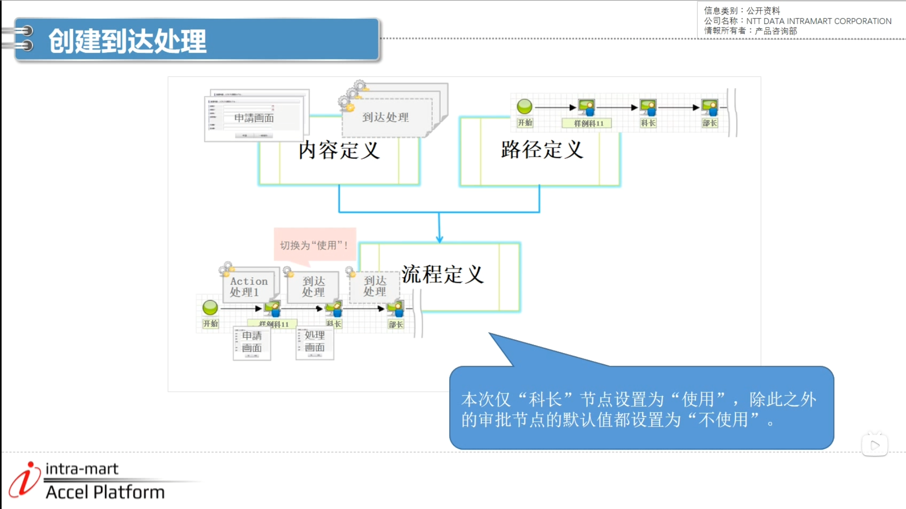

2. 工作流 --> 主数据定义下的流程定义 --> 新建 --> 

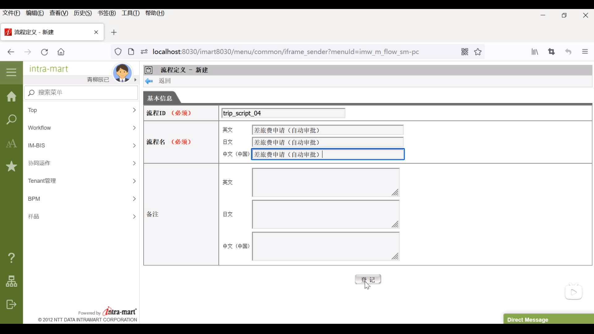

3. 再次点击新建 --> 设置开始日期 --> 内容路径分别选择刚刚创建好的 --> 路径详细 --> 双击科长 --> 节点到达处理选择标准变更 --> 检索 选择到达处理 --> 登记

- 代码参考
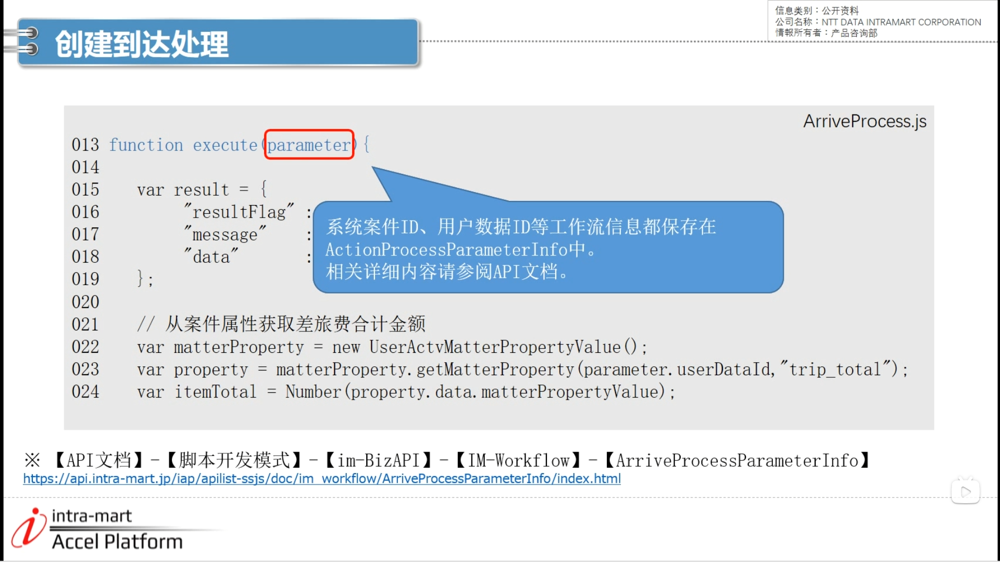

-arriveProcess 
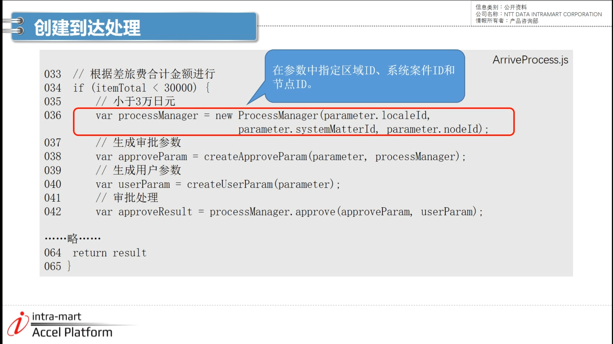

4. wrokflow --> 申请一览表 --> 流程 --> 差旅费申请（自动审批）--> 进入脚本开发模式页面 输入申请内容 --> 输入小于3w的数字 --> 申请

5. 点击已处理（未完成） --> 选中自动审批 --> 选择右侧流程图标 --> 案件已经自动移动

6. 同样方法设置一个大于3w的案件 --> 做检查