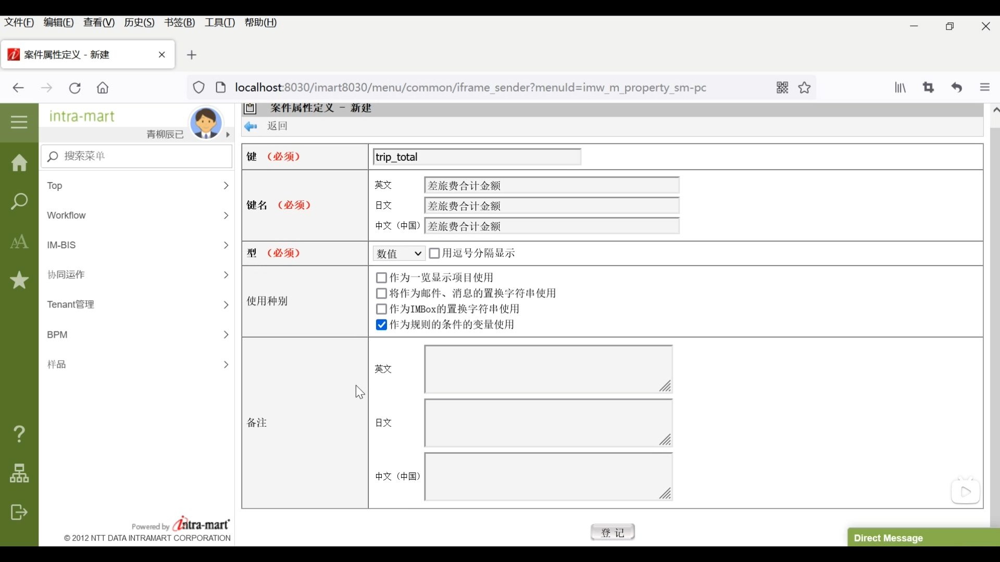

#### 1 什么是案件属性
1. 

2. 

#### 2 设置各种定义
3. 登录账号 --> 左下角网站地图 --> 工作流 --> 主数据定义下的案件属性定义 --> 新建

4.  工作流 --> 主数据定义下的案件属性定义 --> 规则定义 --> 新建 --> 再定义一个小于5w

5. 工作流 --> 主数据定义下的案件内容定义 --> 选择之前创建好的 --> 版本 --> 编辑 --> 用户程序  --> 编辑

6. 点击规则 --> 新建 --> 登记创建的两个规则

7. 工作流 --> 主数据定义下的案件路径定义 -->  新建 

8. 再次新建 --> 设置开始时间后如图添加流程

9. 工作流 --> 主数据定义下的案件流程定义 --> 新建 --> 路径详细 --> 双击分支开始 --> 选择用规则定义开始分支 --> 分别检索 选择大于和小于 （大于5w到部长 小于5w到科长）--> 登记

#### 3登记案件属性信息
本次登记的是交通费+住宿费 
10. 补充程序

11. 用户更新案件属性的方法

12. wrokflow --> 申请一览表 --> 差旅费申请 --> 进入脚本开发模式页面 新建依次填写 （案件名 大于5w日元）--> 点击已处理（未完成） --> 选中分支 --> 选择右侧分支图标 

注意！ 

13.  工作流 --> 主数据定义下的案件内容定义 --> 差旅费申请的编辑图标 --> 版本 --> 编辑 --> 用户程序 --> 编辑 --> 相同方法新建分支2

14. 主数据定义下的案件流程定义 --> 编辑 --> 双击分支开始 --> 修改为用用户定义开始分支 -->分别检索 选择分支程序12 --> 检验是否成功